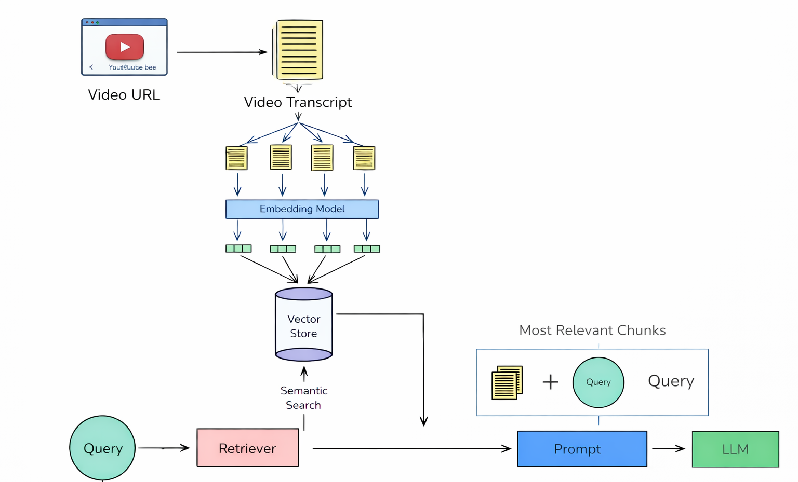
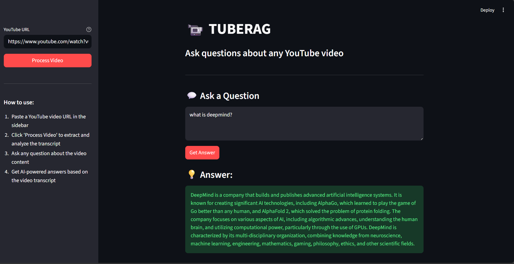

# 📹 YouTube Transcript RAG System

A Retrieval-Augmented Generation (RAG) system that extracts transcripts from YouTube videos, stores them in a vector database, and enables intelligent question-answering based on video content using LangChain and OpenAI.

## Problem Statement

YouTube videos contain valuable information, but extracting specific insights requires watching entire videos or manually searching through transcripts. This is time-consuming and inefficient, especially when dealing with:

- Long-form content (lectures, podcasts, tutorials)
- Multiple videos on similar topics
- Specific information buried in lengthy discussions
- Need for quick fact-checking or reference

**Solution**: This RAG system automatically processes YouTube video transcripts, chunks them intelligently, and enables semantic search with AI-powered question-answering capabilities.

## 🌐 Demo
**LINK** -> https://tuberag.streamlit.app/

## Features

- ✅ Automatic transcript extraction from YouTube videos
- ✅ Intelligent text chunking with overlap for context preservation
- ✅ Vector embeddings for semantic search
- ✅ MMR (Maximal Marginal Relevance) search for diverse, relevant results
- ✅ Context-aware answer generation using GPT-4
- ✅ Persistent vector storage for future queries

## Architecture



---

## Output



---
## Technologies & Methods Used

### 1. **LangChain Framework**
- **Purpose**: Orchestrates the entire RAG pipeline
- **Components Used**:
  - `RunnableParallel`: Parallel execution of retrieval and query passing
  - `RunnablePassthrough`: Passes query unchanged through the chain
  - `RunnableLambda`: Custom document formatting transformation
  - `PromptTemplate`: Structured prompt loading from JSON

### 2. **YouTube Transcript API**
- **Method**: `YouTubeTranscriptApi.list_transcripts()`
- **Purpose**: Extracts video captions/subtitles
- **Language**: English transcripts with fallback handling

### 3. **Text Chunking**
- **Method**: `RecursiveCharacterTextSplitter`
- **Configuration**:
  - `chunk_size=500`: Each chunk contains ~500 characters
  - `chunk_overlap=80`: 80 characters overlap between chunks
- **Purpose**: Maintains context across chunk boundaries for better retrieval

### 4. **Vector Embeddings**
- **Model**: OpenAI `text-embedding-3-small`
- **Purpose**: Converts text chunks into dense vector representations
- **Dimension**: Optimized for semantic similarity search

### 5. **Vector Database**
- **System**: ChromaDB
- **Storage**: Persistent local storage
- **Purpose**: Efficient similarity search and retrieval

### 6. **Retrieval Strategy: MMR (Maximal Marginal Relevance)**
```python
search_type="mmr"
search_kwargs={
    "k": 3,           # Return top 3 documents
    "fetch_k": 7,     # Consider 7 candidates
    "lambda_mult": 0.5  # Balance relevance vs diversity
}
```

**Why MMR?**
- **Relevance**: Retrieves semantically similar chunks
- **Diversity**: Avoids redundant information
- **Balance**: λ=0.5 provides equal weight to similarity and diversity

### 7. **Language Model**
- **Model**: GPT-4o-mini
- **Temperature**: 0.2 (low for factual, consistent responses)
- **Purpose**: Generates natural language answers from retrieved context

### 8. **LangChain Pipeline (LCEL)**

```python
parallel_chain = RunnableParallel({
    "context": retriever | RunnableLambda(lambda docs: "\n\n".join([doc.page_content for doc in docs])),
    "question": RunnablePassthrough()
})

final_chain = parallel_chain | prompt | llm | parser
```

**Pipeline Flow**:
1. **Parallel Execution**: Retrieves context while preserving the question
2. **Context Formatting**: Joins retrieved documents with newlines
3. **Prompt Application**: Injects context and question into template
4. **LLM Generation**: Generates answer based on context
5. **Output Parsing**: Extracts clean string response


---

**Built with ❤️ using LangChain and OpenAI**
